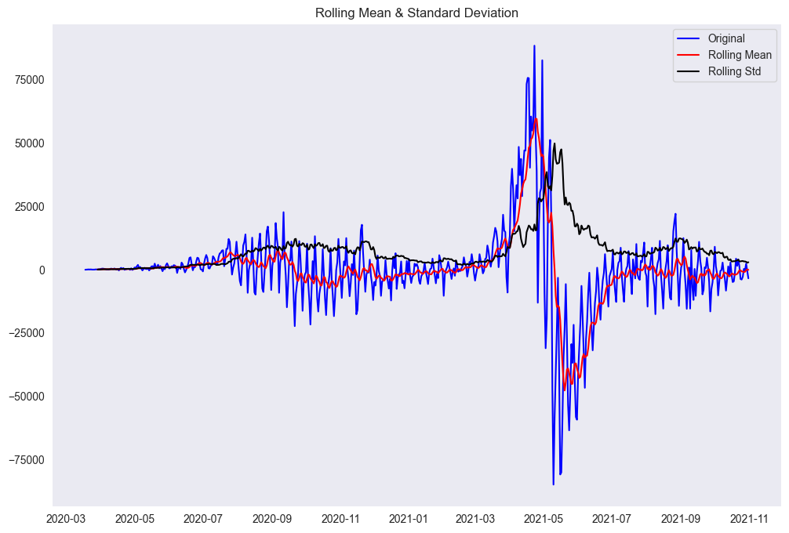

<p align="center">
  
</p>
<p align="center">
    <h1 align="center">COVID-19 TIME SERIES FORECASTING</h1>
</p>
<p align="center">
    <em>'The new normal' --someone</em>
</p>
<p align="center">
	
	
	
<p>
<p align="center">
		<em>Developed with the software and tools below.</em>
</p>
<p align="center">
	
	
	
	
 
    
    
    


</p>
<hr>

##  Quick Links

> - [ 📍Overview](#-overview)
> - [ 📓Generated Plots in the Python Notebook and Analysis](#-features)
> - [ 📂Repository Structure](#-repository-structure)
> - [ 🧩Modules](#-modules)
> - [ 🛠️Project Roadmap](#-project-roadmap)
> - [ 👏Acknowledgments](#-acknowledgments)

---

##  📍Overview

The provided block of code is quite extensive and covers various aspects of time series analysis and forecasting using SARIMAX models. Let's break down the entire block of code and summarize the key steps and concepts involved:

1. **Data Preprocessing:**
   - The code starts by reading a dataset containing daily Covid-19 data for different states in India and performs data cleaning operations like converting the 'Date' column to datetime format, dropping unnecessary columns related to specific states, and focusing on the 'Confirmed' cases.

2. **Exploratory Data Analysis (EDA):**
   - It performs EDA by visualizing the time series data using line plots to understand trends and patterns over time.

3. **Stationarity Check:**
   - The code checks for stationarity using the Augmented Dickey-Fuller (ADF) test. Since the initial series is non-stationary, differencing is applied to make it stationary.

4. **Differencing:**
   - Differencing is applied to remove seasonality from the time series data. After differencing, the stationarity of the differenced series is checked again.

5. **Seasonal Decomposition:**
   - Seasonal decomposition using an additive model is performed to analyze trend, seasonality, and residual components of the time series.

6. **Autocorrelation and Partial Autocorrelation Analysis:**
   - ACF and PACF plots are generated to analyze autocorrelation and partial autocorrelation in the time series data, which helps in determining the orders of ARIMA components for modeling.

7. **SARIMAX Modeling:**
   - SARIMAX (Seasonal AutoRegressive Integrated Moving Average with eXogenous factors) modeling is employed for time series forecasting. The SARIMAX model parameters are chosen based on ACF and PACF analysis and model diagnostics.

8. **Model Diagnostics:**
   - Diagnostic tests such as the Jarque-Bera test are conducted on model residuals to check for normality and goodness of fit.

9. **Forecasting:**
   - Future values are forecasted using the trained SARIMAX model. The forecasted values are added to the DataFrame and plotted along with the actual values to visualize the forecast accuracy.

10. **Dynamic Forecasting:**
    - There's an attempt to perform dynamic forecasting for future predictions. However, in the current model, dynamic forecasting does not impact the results significantly.

Overall, the code covers a comprehensive workflow for time series analysis, including data preprocessing, stationarity checks, model selection, diagnostics, and forecasting using SARIMAX models. It leverages libraries like pandas, matplotlib, seaborn, statsmodels, and scipy for various analysis and visualization tasks, making it a robust approach for time series forecasting tasks like Covid-19 cases prediction.

---

##  📓Generated Plots in the Python Notebook


<br>*Line plot of total covid cases with time*


<br>*Trend plot showing the seasoanlity of total covdi cases*


<br>*Rolling mean and std of original data*



<br>*Rolling mean and std of data after making it stationary*


<br>*Residuals Distribution of SARIMAX model*


<br>*Performance of Forecast SARIMAX model*


<br>*Forecast for next seven days*

---

##  📂Repository Structure

```sh
└── covid-19-time-series-forecasting/
    ├── README.md
    ├── covid-time-series.ipynb
    └── img
        ├── SARIMAX_residuals.png
        ├── line_plot_TT_time.png
        ├── model_forecast.png
        ├── prediction_7_day.png
        ├── rolling_mean_std.png
        ├── rolling_mean_std_post_stat.png
        └── trend_plot_TT_seasonal.png
```

---

##  🧩Modules


| File                                                                                                                            | Summary                                             |
| ---                                                                                                                             | ---                                                 |
| [covid-time-series.ipynb](https://github.com/rohan-deswal/covid-19-time-series-forecasting/blob/master/covid-time-series.ipynb) | The notebook utilizes SARIMAX models to analyze and forecast daily Covid-19 data in Indian states. It begins by preprocessing the data, focusing on 'Confirmed' cases, and then conducts exploratory data analysis (EDA) using line plots to identify trends. Stationarity checks are performed using the Augmented Dickey-Fuller (ADF) test and differencing techniques. Seasonal decomposition is applied to understand trend, seasonality, and residuals, followed by ACF and PACF analysis to determine ARIMA model components. SARIMAX models are then built based on the analysis, with diagnostics checks performed. The code also includes forecasting steps for future values and dynamic forecasting to improve predictions, providing a comprehensive time series forecasting workflow using pandas, matplotlib, seaborn, statsmodels, and scipy libraries. `covid-time-series.ipynb` |

</details>

---

##  🛠️Project Roadmap

- [X] `► Fetch data from API URL and drop statewise data`
- [X] `► Exploratory Data plotting`
- [X] `► Stationarity check and conversion to stationary data`
- [X] `► SARIMAX Modelling to forecast next seven days of data`

---


## 👏Acknowledgments

- Inspirational Source: [`https://www.kaggle.com/sumi25/understand-arima-and-tune-p-d-q`](https://www.kaggle.com/sumi25/understand-arima-and-tune-p-d-q)
- Inspirational Source: [`https://github.com/parthbhide/Time-Series-Forecasting-for-Covid-19`](https://github.com/parthbhide/Time-Series-Forecasting-for-Covid-19)
- Refernce Material for genral python machine learning methods: [`https://machinelearningmastery.com/time-series-forecasting-methods-in-python-cheat-sheet/`](https://machinelearningmastery.com/time-series-forecasting-methods-in-python-cheat-sheet/)
- Dataset source: [`https://api.covid19india.org/`](https://api.covid19india.org/)
- SARIMAX Documentation: [`https://www.statsmodels.org/dev/generated/statsmodels.tsa.statespace.sarimax.SARIMAX.html`](https://www.statsmodels.org/dev/generated/statsmodels.tsa.statespace.sarimax.SARIMAX.html)
---